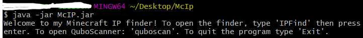

# McIp
Minecraft server IP finder written in Java
# Example of running the program after compiling

# Running the program
Running the program is pretty straight-forward. The code proves it, jkjk: compile the src folder then cd into the location of the executable. Type java -jar McIp.jar
The program will tell you what can you do with it.
